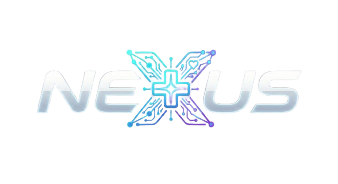

<p align="center">
  
</p>

<h1 align="center">Nexus - Hub de Inteligência Hospitalar</h1>

<p align="center">
  
  
  
  
  
</p>

---

## 🏥 Visão Geral

O **Nexus** atua como o **Hub de Inteligência Hospitalar** no ambiente do **HMSJ (Hospital Municipal São José)**. Seu objetivo principal é centralizar a inteligência e a gestão hospitalar em uma única plataforma, promovendo eficiência, transparência e agilidade na tomada de decisão em processos cruciais do hospital.

Atualmente, o Nexus contempla os seguintes módulos integrados:
- 📅 **AIHs Cirurgias Eletivas**: Gestão e inteligência de cirurgias e procedimentos eletivos.
- 📋 **Kanban de Altas (Giro de Leitos)**: Núcleo avançado de gestão operacional do NIR. Combina automação de importações via RPA (Censo MV) com a **Soberania da Decisão Clínica**. Destacam-se:
  - **Gestão Semântica de Especialidades**: Sistema dual de equipe (Principal e Acompanhantes) com proteção de nível banco de dados (`is_manual`) contra sobreposições robóticas.
  - **Filtros e KPIs de Alta Performance**: Motor Reativo que calcula o tempo de giro de leito (Verde a Preto), monitora antibióticos cronometrados e acusa fluxos setoriais (EMAD, Trauma) instantaneamente.
  - **Auditoria Transparente (Nexus Logs)**: O "Sino de Atividades", suportado pelo Firestore, rastreia e consolida _Logs Semânticos_ de quem fez cada ação clínica/documental em tempo real.
  - **Universidade Nexus**: Módulo *in-app* projetado para fixar o _Onboarding_ visual prático para todo novo médico ou enfermeiro da base.
- 🧠 **Telemonitoramento AVC (Pós-Alta)**: Fluxo completo de navegação do paciente (Triagem, Exames, Agendamentos, Desfechos e CRM) com disparos automáticos de e-mail e Kanban Reativo.

---

## 🏗️ Arquitetura e Stack Técnica

O projeto foi construído utilizando tecnologias modernas visando alta performance, escalabilidade e manutenibilidade.

### 💻 Frontend
- **React (v19)**: Biblioteca principal para construção de interfaces.
- **Vite**: Ferramenta de build super rápida.
- **Tailwind CSS**: Framework utilitário para estilização e design responsivo (**Mobile-First**).
- **Framer Motion**: Biblioteca de animações para transições de página (Fade-in + Slide).
- **React Router DOM**: Gerenciamento de rotas da aplicação (Single Page Application).

### ⚙️ Backend & Infraestrutura
- **Firebase Firestore**: Banco de dados NoSQL focado em alta reatividade (onSnapshot/Realtime).
- **Firebase Hosting**: Hospedagem da aplicação web.

### 🔌 Integrações e Bibliotecas Utilitárias
- **Gmail API**: Utilizada para disparar e-mails institucionais dinâmicos (Listas Ambulatoriais) de forma transparente através do Google Auth.
- **PapaParse**: Processamento e conversão de dados em formato CSV.
- **SheetJS (XLSX)**: Leitura, manipulação e exportação de planilhas.
- **React Toastify**: Sistema de notificações e alertas modais em tela (Em substituição ao `window.alert`).

---

## 🚀 Guia de Instalação

Siga os passos abaixo para configurar o ambiente de desenvolvimento localmente.

### Pré-requisitos
- [Node.js](https://nodejs.org/) (versão 18+ recomendada)
- NPM ou Yarn

### Passo a Passo

1. **Clone o repositório**
   ```bash
   git clone <URL_DO_REPOSITORIO>
   cd nexushmsj
   ```

2. **Instale as dependências**
   ```bash
   npm install
   ```

3. **Configuração de Variáveis de Ambiente**
   Crie um arquivo `.env` na raiz do projeto (como cópia do `.env.example`, caso exista) e preencha as variáveis de ambiente necessárias para o Firebase e outras integrações:
   ```env
   VITE_FIREBASE_API_KEY=sua_api_key
   VITE_FIREBASE_AUTH_DOMAIN=seu_auth_domain
   VITE_FIREBASE_PROJECT_ID=seu_project_id
   VITE_FIREBASE_STORAGE_BUCKET=seu_storage_bucket
   VITE_FIREBASE_MESSAGING_SENDER_ID=seu_sender_id
   VITE_FIREBASE_APP_ID=seu_app_id
   ```

4. **Inicie o Servidor de Desenvolvimento**
   ```bash
   npm run dev
   ```
   A aplicação estará disponível em `http://localhost:5173`.

---

## 📜 Licença

Este projeto está licenciado sob a **GNU General Public License v3 (GPLv3)**.

Você pode redistribuí-lo e/ou modificá-lo sob os termos da GNU General Public License, conforme publicada pela Free Software Foundation; seja a versão 3 da Licença ou (a seu critério) qualquer versão posterior.

Para mais detalhes, veja o arquivo LICENSE do repositório ou acesse [GNU GPLv3](https://www.gnu.org/licenses/gpl-3.0.html).

---

## 👤 Autor e Desenvolvedor

**Bruno Vinicius da Silva**

- **Formação:** Enfermeiro (PUCPR, 2021) | Analista de Sistemas (PUCPR, 2024).
- **Especializações:** Saúde da Família (SMS Florianópolis, 2023), Gestão Hospitalar (PUCPR, 2025) e Ciência de Dados Aplicada à Saúde (PUCMINAS, 2026).
- **Atuação:** Servidor Público na Prefeitura de Joinville, lotado como Enfermeiro no Núcleo Interno de Regulação (NIR) do Hospital Municipal São José.

### Contatos:
- LinkedIn: [linkedin.com/in/enfbrunovinicius](https://www.linkedin.com/in/enfbrunovinicius/)
- GitHub: [github.com/bruvini](https://github.com/bruvini)
- Email Pessoal: bruvini.silva12@gmail.com
- Email Institucional: bruno.vinicius@joinville.sc.gov.br

---

<p align="center">
  Desenvolvido com 💡 para o <b>Hospital Municipal São José</b>.
</p>
